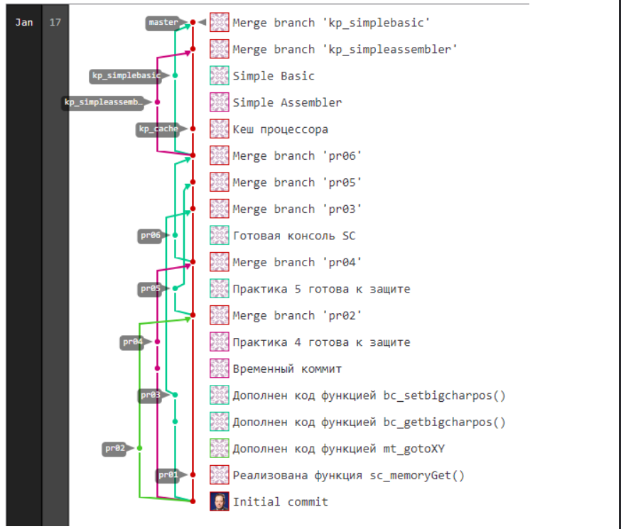
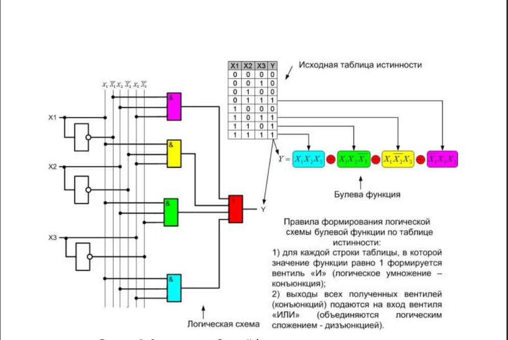
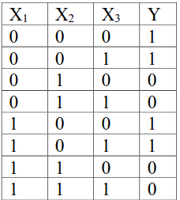
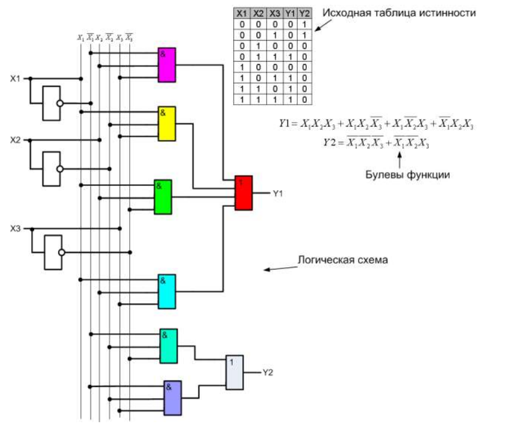
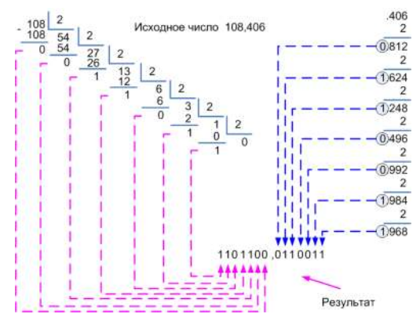

# Архитектуры ЭВМ - Лабораторные работы

Репозиторий для выполнения лабораторных работ по дисциплине "Архитектуры ЭВМ".

## 📋 Инструкция по созданию новых веток

Ветки создаются **с использовании примерной схемы веток**, которая предоставлена ниже в `Примерная схема веток`
- Для каждой практической работы создается отдельная ветка **pr0x**, где `x` - номер ветки
- При создании новой ветки, последний коммит должен называться **"Final x pr commit"**, где `x` - номер лабораторной работы.

## 🛠️  Сборка и запуск
- Все команды выполняются из корня проекта:
```markdown
|   Команда      |  Действие   |                            Описание                       |
------------------------------------------------------------------------------------------
|  `make`        | **Сборка**  | Компилирует `.c` файлы в `.o` и собирает исполняемый файл |
|  `make run`    | **Запуск**  | Компилирует проект (если нужно) и запускает приложение    |
|  `make clean`  | **Очистка** | Удаляет все временные объектные файлы и бинарники         |
```

## 📁 Структура проекта
```text
.
├── console
│   ├── console.h
│   ├── main.c
│   ├── Makefile
│   ├── signalhandler.c
│   ├── test.c
│   └── variables.c
├── include
│   ├── myBigChars.h
│   ├── myReadKey.h
│   ├── mySimpleComputer.h
│   └── myTerm.h
├── myBigChars
│   ├── main.c
│   └── Makefile
├── myReadKey
│   ├── main.c
│   ├── Makefile
│   └── rk_variables.c
├── mySimpleComputer
│   ├── main.c
│   ├── Makefile
│   ├── sc_commandDecode.c
│   ├── sc_commandEncode.c
│   ├── sc_commandValidate.c
│   └── sc_variables.c
├── myTerm
│   ├── main.c
│   ├── Makefile
│   └── mt_clrscr.c
├── simpleassembler
│   ├── main.c
│   └── Makefile
├── simplebasic
├── Makefile
├── README.md
└── photoKQ
    └── photo_1_1.jpg

```

## 🌳 Примерная схема веток


        

## ✅ Требования к каждой лабораторной работе

- [ ] Создать отдельную ветку из `main`
- [ ] Разделить работу поровну (50/50) между участниками
- [ ] Каждый разработчик работает после другого
- [ ] Объединить работу в финальный коммит
- [ ] Назвать финальный коммит "Final X lab commit"
- [ ] Не выполнять merge в исходную ветку лабораторной работы
- [ ] Добавлять к README.MD задачи лабораторной работы + контрольные вопросы и ответы на них

## 👥 Участники

- **Эльнур Гасымов Тофиг Оглы ИС-443** — Разработчик
- **Артем Учайкин Игоревич ИС-443** — Разработчик

---

# Практическое задание № 1. Подготовка инфраструктуры для разработки проекта.

## Цель работы: 
- [ ] Изучить принципы работы оперативной памяти 
- [ ] Познакомиться с разрядными операциями языка Си
- [ ] Разработать библиотеку mySimpleComputer, включающую функции по декодированию команд, управлению регистрами и взаимодействию с оперативной памятью

## Задание на практическое занятие
10. Прочитайте главу 2 учебного пособия. Изучите принципы работы разрядных операций в языке Си: как можно изменить значение указанного разряда целой переменной или получить его значение. Вспомните, как сохранять информацию в файл и считывать её оттуда в бинарном виде

11. Разработайте часть библиотеки mySimpleComputer, моделирующую работу оперативной памяти и прямого доступа к ней (используется для контроллера оперативной памяти центрального процессора и устройства ввода-вывода):
    - 1.  В качестве «оперативной памяти» используется массив целых чисел, определенный статически в рамках библиотеки (глобальная переменная внутри библиотеки). Размер массива равен 128 элементам. Тип элементов массива – целые числа (int). Массив, содержащий «оперативную память» доступен только функциям библиотеки (в пользовательском API он отсутствует)
    - 2.  int sc_memoryInit (void) – инициализирует оперативную память Simple Computer, задавая всем её ячейкам нулевые значения
    - 3.  int sc_memorySet (int address, int value) – задает значение указанной ячейки памяти как value. Если адрес выходит за допустимые границы или value не соответствует допустимому диапазону значений, то функция возвращает -1, иначе завершается корректно и возвращает 0
    - 4.  int sc_memoryGet (int address, int * value) – возвращает значение указанной ячейки памяти в value. Если адрес выходит за допустимые границы или передан неверный указатель на value, то функция завершается со статусом -1. В случае успешного выполнения функции она завершается со статусом 0
    - 5.  int sc_memorySave (char * filename) – сохраняет содержимое памяти в файл в бинарном виде (используя функцию write или fwrite). Если передан неверный указатель на имя файла или произошла какая-либо ошибка записи данных в файл, то функция завершается со статусом -1. В случае успеха функция завершается со статусом 0
    - 6.  int sc_memoryLoad (char * filename) – загружает из указанного файла содержимое оперативной памяти (используя функцию read или fread). Если передан неверный указатель на имя файла или произошла какая-либо ошибка чтения данных из файла, то функция завершается со статусом -1, при этом содержимое «оперативной памяти» никак не изменяется (т.е. оно не должно портиться). В случае успеха функция завершается со статусом 0

12. .Разработайте часть библиотеки mySimpleComputer, моделирующую регистры Simple Computer
    - 1.    регистры «Аккумулятор», «Счетчик команд», «Регистр флагов» - целые переменные (глобальные для библиотеки и недоступные напрямую пользователю)
    - 2.  int sc_regInit (void) – инициализирует регистр флагов значениями по умолчанию
    - 3.  int sc_regSet (int register, int value) – устанавливает значение указанного регистра флагов. Для номеров регистров флагов должны использоваться маски, задаваемые макросами (#define). Если указан недопустимый регистр, то функция завершается
    - 4.  int sc_regGet (int register, int * value) – возвращает значение указанного флага. Если указан недопустимый регистр и передан неверный указатель на значение, то функция завершается со статусом -1. Иначе статус завершения – 0 со статусом -1 и значение флага не меняется. Иначе статус завершения – 0. Флаг меняется в соответствии с правилами определения
    - 5. int sc_accumulatorInit (void) – инициализирует аккумулятор значением по умолчанию
    - 6. int sc_accumulatorSet (int value) – устанавливает значение аккумулятора. Если указано недопустимое значение, то функция завершается со статусом -1 и значение аккумулятора не меняется. Иначе статус завершения – 0 логического значения целой переменной, принятых в языке Си
    - 7. int sc_accumulatorGet (int * value) – возвращает значение аккумулятора. Если передан неверный указатель на значение, то функция завершается со статусом -1. Иначе статус завершения – 0
    - 8. int sc_icounterInit (void) – инициализирует счетчик команд
    - 9. int sc_icounterSet (int value) – устанавливает значение счетчика команд. Если указано недопустимое значение, то функция завершается со статусом -1 и значение счетчика не меняется. Иначе статус завершения – 0

13. Разработайте часть библиотеки mySimpleComputer, моделирующую часть устройства управления, отвечающую за кодирование и декодирование команды
    - 1. int sc_commandEncode (int sign, int command, int operand, int * value) – кодирует значение ячейки в соответствии с форматом команды Simple Computer и с использованием в качестве значений полей полученные знак, номер команды и операнд и помещает результат в value. Если указаны недопустимые значения для знака, команды или операнда, то функция завершается со статусом -1 и значение value не изменяется. В противном случае – статус завершения 0. Для знака, операнда и команды допустимыми являются все значения, которые соответствуют формату команды Simple Computer 
    - 2. int sc_commandDecode (int value, int * sign, int * command, int * operand) – декодирует значение ячейки памяти как команду Simple Computer. Если декодирование невозможно, то функция завершается со статусом -1 и выходные параметры не меняю своего значения. Иначе статус завершения = 0
    - 3. int sc_commandValidate (int command) – проверяет значение поля «команда» на корректность. Если значение некорректное, то возвращается -1. Иначе возвращается 0
14. Оформите разработанные функции как статическую библиотеку. Подготовьте заголовочный файл для неё. Доработайте систему сборки приложения таким образом, чтобы статическая библиотека mySimpleComputer собиралась при изменении любого из файлов с исходным кодом. Собранная библиотека должна располагаться в каталоге mySimpleComputer
15. Разработайте часть устройства ввода-вывода (все данные, выводимые функциями в рамках данного практического задания, просто выводятся на экран, без формирования интерфейса консоли)
    - 1. void printCell (int address) – выводит на экран содержимое ячейки оперативной памяти по указанному адресу. Формат вывода должен соответствовать заданию (ячейка выводится в декодированном виде)  
    - 2. void printFlags (void) – выводит значения флагов. Формат должен соответствовать заданию (выводятся либо _, либо буквы в заданной последовательности)
    - 3. void printDecodedCommand (int value) – выводит переданное значение в десятичной системе счисления, в восьмеричной системе счисления, в шестнадцатиричной системе счисления и в двоичной системе счисления
    - 4. void printAccumulator (void) – выводит значение аккумулятора
    - 5. void printCounters (void) – выводит значение счетчика команд
16. Разработайте тестовую программу pr01, которая должна использовать все созданные выше функции и библиотеку mySimpleComputer и выполнять следующие действия
    - 1. инициализировать оперативную память, аккумулятор, счетчик команд и регистр флагов 
    - 2. установить произвольному количеству произвольных ячеек оперативной памяти произвольные значения. Вывести содержимое оперативной памяти (в декодированном формате по 10 ячеек в строке через пробел)
    - 3. попробовать задать какой-нибудь ячейке оперативной памяти недопустимое значение и вывести статус завершения соответствующей функции
    - 4. установить произвольные значения флагов и вывести содержимое регистра флагов
    - 5. попробовать установить некорректное значение флага. Вывести статус завершения функции
    - 6. установить значение аккумулятора и вывести его на экран
    - 7. попробовать задать аккумулятору недопустимое значение и вывести статус завершения функции
    - 8. установить значение счетчика команд и вывести его на экран
    - 9. попробовать задать счетчику команд недопустимое значение и вывести статус завершения функции
    - 10. декодировать значение произвольной ячейки памяти и значение аккумулятора
    - 11. закодировать команду (любую допустимую из системы команд) и вывести полученное значение в разных системах счисления
17. Итоговый исполняемый файл должен называться pr01 и располагаться в каталоге console
18. Доработайте Makefile таким образом, чтобы автоматизированная сборка смогла собрать библиотеку и исполняемый файл pr01. Исполняемый файл должен собираться при изменении библиотеки или любого из исходных файлов каталога console. Также необходимо реализовать в Makefile искусственные цели по очистке каталога проекта от временных файлов (цель clean)
    
## Контрольные вопросы
9. Что такое вентиль? Какие значения он может принимать?
   - Основными элементами, на которых строятся ЭВМ, являются простые цифровые устройства – **вентили**, которые могут **принимать два значения** – «нуль» и «единица». Чаще всего состоянию «единица» соответствует положительное напряжение (например, + 5 В) на его выходе, состоянию «нуль» – нулевое напряжение. Схемы из вентилей могут вычислять различные функции от этих двух значений. Эти элементы формируют основу для построения сложных цифровых схем 

10. Сколько вентилей необходимо, чтобы получить логические функции НЕ, ИЛИ-НЕ, И-НЕ, И, ИЛИ?
    - для реализации схем **И-НЕ и ИЛИ-НЕ** требуется всего **два транзистора**, а для схем **И и ИЛИ** – **три**. Для **НЕ** - **один**. По этой причине чаще всего используются только вентили НЕ, И-НЕ и ИЛИ-НЕ

11. Что такое таблица истинности? Булева функция? Как они связаны между собой? 
    - 1. Если написать таблицу, в которой перечислить всевозможные комбинации входных переменных и соответствующие этим комбинациям значения функций (выходное значение), то получится таблица истинности. Очевидно, что размер таблицы определяется числом переменных в функции и может быть огромным (2n , гдеn – число входных переменных)
    - 2. Как и в обычной алгебре, правила преобразования входных значений в выходные называются **функциями**, которые могут зависеть от одной или нескольких переменных, и получать результат (0 или 1), основываясь только на их значениях. Если функция содержит n переменных, то существует 2n возможных наборов значений функции
    - 3. Наглядный пример связи:
      

12. Как получить алгебраическую булеву функцию из таблицы истинности? И наоборот?
    - Как альтернатива таблицы истинности используется **алгебраическая запись**, в которой **перечисляются все комбинации переменных**, дающие единичное (или нулевое) значение функции. При этом знаком **умножения обозначается операция И, а знаком сложения – операция ИЛИ, черта над переменной означает операцию НЕ**
    Пример:
       
      функция примет вид: $$Y = \overline{X_1X_2X_3} + \overline{X_1X_2}X_3 + X_1\overline{X_2X_3} + X_1\overline{X_2}X_3$$ 

13. Каким образом можно синтезировать логическую схему по таблице истинности? По алгебраической формуле?
    - Синтез логической схемы осуществляется аналогично получению булевой функции из таблицы истинности (рис. 9). Для каждой строки таблицы истинности (или для каждого слагаемого булевой функции, если схема строится на основе неё) формируется вентиль И. Все полученные вентили объединяются через вентиль ИЛИ, в результате чего получается выход схемы 
      
    
14. Что такое система счисления? Чем отличается позиционная система счисления от непозиционной?
    - Для записи чисел человечеством придуманы различные правила, называемые **системами счисления**. По этим правилам любое число представляется в виде набора специальных символов – цифр. Получение количественного эквивалента числа осуществляется по алгоритму замещения, согласно которому сначала цифры заменяются их количественными эквивалентами, а затем эквивалент числа получается путём арифметических операций над эквивалентами цифр
    - В зависимости от того, меняет ли свое количественное значение цифра при разном положении в числе, системы счисления можно классифицировать как **непозиционные и позиционные** системы. 
      В **непозиционных** системах число образуется из цифр, значение которых не изменяется при различном положении цифр в числе
      В **позиционных** системах счисления количественное значение цифры определяется её позицией в числе. Номер позиции называется **разрядом**. Число цифр, используемых для представления чисел, называется **основанием**

15. Как получить качественный эквивалент числа в непозиционной системе счисления? В позиционной?
    - Примером **непозиционных** систем служит римская система счисления. В ней в качестве цифр для составления чисел используются буквы латинского алфавита. I означает единицу, V – пять, X – десять, L – пятьдесят, C – сто, D – пятьсот, M – тысячу. Для получения числа требуется просто просуммировать количественные эквиваленты входящих в него цифр, с учётом того, что если младшая цифра идет перед старшей цифрой, то она входит в сумму с отрицательным знаком. Например, DLXXVII = пятьсот + пятьдесят + десять + десять + пять + один + один = пятьсот семьдесят семь. Или CDXXIX = минус сто + пятьсот + десять + десять + минус один + десять = четыреста двадцать девять
    - В **позиционных** системах - Число в позиционной системе счисления с основанием $p$ (цифры: $\{a_i\}$, $i = 0, n-1$ т.е. числа, имеющие вид $a_{n-1}a_{n-2}...a_1a_0$), может быть получено следующим образом:
    
      $$A_{(p)} = a_{n-1}p^{n-1} + a_{n-2}p^{n-2} + ... + a_1p^1 + a_0p^0$$
    
      **Разрядность** числа определяется максимальным эквивалентом, который можно получить для такого числа:
    
      $$A^{\max}_{(p)} = p^n$$

      Более простой пример: перевод числа из двоичной системы в десятичную

16. Как перевести числа из двоичной системы счисления в десятичную? Восьмеричную? Шестнадцатеричную? И наоборот?
    - Для перевода чисел между системами счисления используются методы умножения на степени основания (для десятичной) или группировка бит (для 8-и/16-и). Основной принцип: в 10-ю — через развернутую форму, из 10-й — делением, а в 2/8/16 — через разбиение
    - **Двоичная система в Десятичную (2 -> 10)** 
    Суммируйте степени двойки (начиная с 2^0 справа) для каждого разряда, где стоит 1. (Для 8, 16 пример похожий, только вместо 2 - 8 или 16)
      $$ 1011 = 1*2^3 + 0 * 2^2 + 1 * 2^1 + 1 * 2^0 $$
         
   - **Десятичная система в Двоичную (10 -> 2)**
      Последовательно делите число на 2, записывая остатки (0 или 1) в обратном порядке. (Для 8, 16 пример похожий, только вместо 2 - 8 или 16)
      $$ 13/2 = 6 (ост. 1), 6/2 = 3 (ост. 0), 3/2 = 1 (ост. 1), 1/2 = 0 (ост. 1) = 1 + 1 + 0 + 1 = 1101 $$
         
17. Что такое двоично-десятичное число?
    - Двоично-десятичные числа – это специальный вид представления числовой информации, в основу которого положен принцип кодирования каждой десятичной цифры группой из четырёх бит. При этом каждый байт содержит одну или две цифры. Первый способ называется неупакованное число, второй – упакованное. Например, число 3456 может быть записано как неупакованное в виде 00000011 00000100 00000101 00000110, или как упакованное – 0011 0100 0101 0110

18. Как в ЭВМ представляются отрицательные числа и числа с плавающей запятой?
    - **Отрицательные целые числа в ЭВМ** представляются в специальном виде, называемом **дополнительным кодом**, который позволяет при выполнении операций исключить отличия отрицательных чисел от положительных.
    **Дополнительный код** отрицательного числа представляет собой результат инвертирования (замены в числе нулей на единицы и наоборот) каждого бита двоичного числа (модуля отрицательного числа) и прибавления к нему единицы.
    Обратное преобразование числа из дополнительного кода в обычный вид осуществляется аналогичным образом (сначала инвертируется, затем прибавляется 1)
    - **Вещественные числа в ЭВМ** могут быть представлены в форме с фиксированной или плавающей запятой   
        - Представление числа в форме с фиксированной запятой (иногда называют естественной формой) включает знак числа и его модуль в $q$-ичном коде. Здесь $q$ — основание системы счисления. Количество разрядов, отводимых под дробную часть, определяет точность представления.

            Запись числа с фиксированной запятой может иметь вид $a_{n-1}a_{n-2}...a_1a_0a_{-1}a_{-2}...a_{-m}$. Количественный эквивалент такого числа задаётся формулой:

            $$A_{(p)} = a_{n-1}p^{n-1} + a_{n-2}p^{n-2} + \dots + a_1p^1 + a_0p^0 + a_{-1}p^{-1} + a_{-2}p^{-2} + \dots + a_{-m}p^{-m}.$$ 
         
        - Перевод числа с фиксированной запятой из десятичной системы в двоичную выполняется в два этапа: сначала переводится целая часть обычным способом, затем дробная часть переводится последовательным умножением на основание и выделением целой части на каждом шаге до достижения требуемой точности.

        - Числа в формате с **плавающей запятой** представляются в виде двух групп цифр — мантиссы и порядка. Общая форма записи:

            $$X = \pm m q^{e},$$

            где $m$ — мантисса, $q$ — основание системы счисления, $e$ — порядок (экспонента). Такая нормализованная запись позволяет представлять гораздо больший динамический диапазон значений, чем фиксированная запятая.

        - Точность представления в формате с плавающей запятой определяется числом разрядов, отводимых под мантиссу, а диапазон — количеством разрядов для порядка.  
         
19. Что такое дополнительный код? Зачем он используется?
    - **Дополнительный код** отрицательного числа представляет собой результат инвертирования (замены в числе нулей на единицы и наоборот) каждого бита двоичного числа (модуля отрицательного числа) и прибавления к нему единицы.
    Обратное преобразование числа из дополнительного кода в обычный вид осуществляется аналогичным образом (сначала инвертируется, затем прибавляется 1)

20. Как перевести десятичное число с плавающей запятой в двоичное?
    - Перевод числа с **фиксированной** запятой из десятичной системы в двоичную выполняется в два этапа: сначала **переводится целая часть** обычным способом, затем **дробная часть переводится последовательным умножением** на основание и выделением целой части на каждом шаге до достижения требуемой точности.

21. Какие базовые типы данных используются для хранения переменных в языке СИ?
    - В стандарте ANSI языка Си определены следующие базовые типы переменных:

    | Тип | Описание |
    | --- | --- |
    | `int` | Знаковый целый |
    | `char` | Символьный |
    | `float` | Вещественный одинарной точности с плавающей запятой |
    | `double` | Вещественный двойной точности с плавающей запятой |

22. Что такое флаг? Зачем он используется? Каким образом можно манипулировать флагами? Что такое маска?
    - **Флаг** - переменная, где может хранниться только 0 или 1
    - **Флаги необходимы** для обеспечения автоматического управления ходом выполнения программы на основе данных, полученных в предыдущих вычислениях
    - **Для манипуляции** отдельными битами целых переменных **в языке Си** используются поразрядные операции: И, ИЛИ, НЕ, ИСКЛЮЧАЮЩЕЕ ИЛИ, СДВИГ ВЛЕВО, СДВИГ ВПРАВО. 
    - **Маска** - это двоичное число, используемое для выделения, изменения или скрытия определенных битов в другом числе или наборе данных. Маска позволяет работать с конкретными битами, игнорируя остальные, что оптимизирует алгоритмы и экономит память

**Последнее обновление:** 18 февраля 2026 г.
