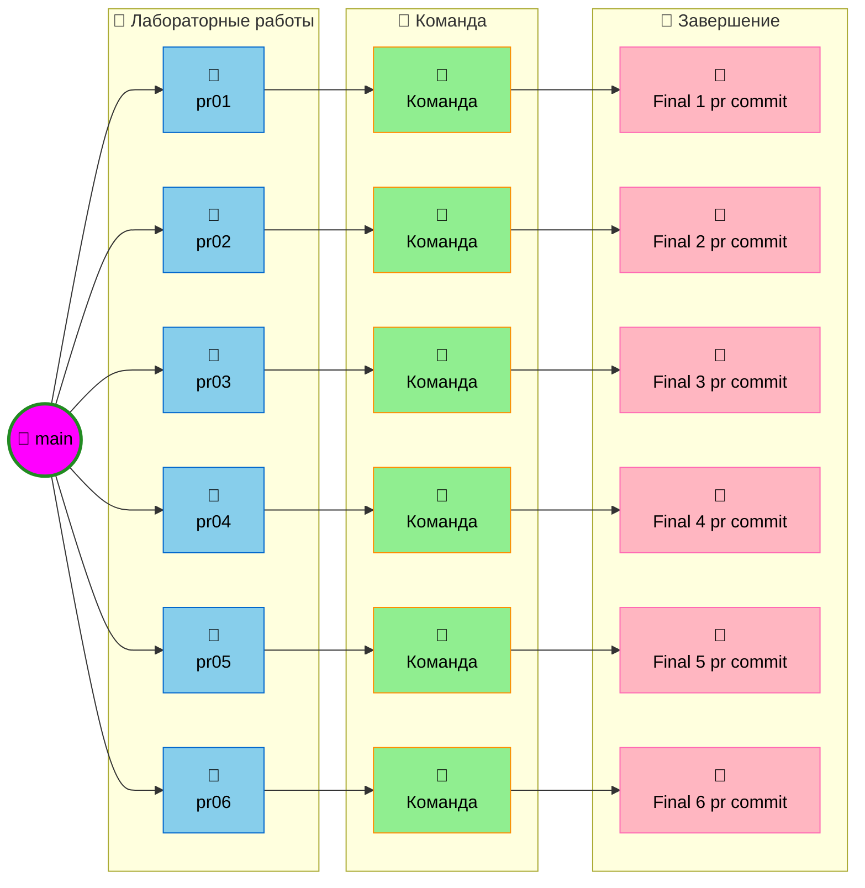
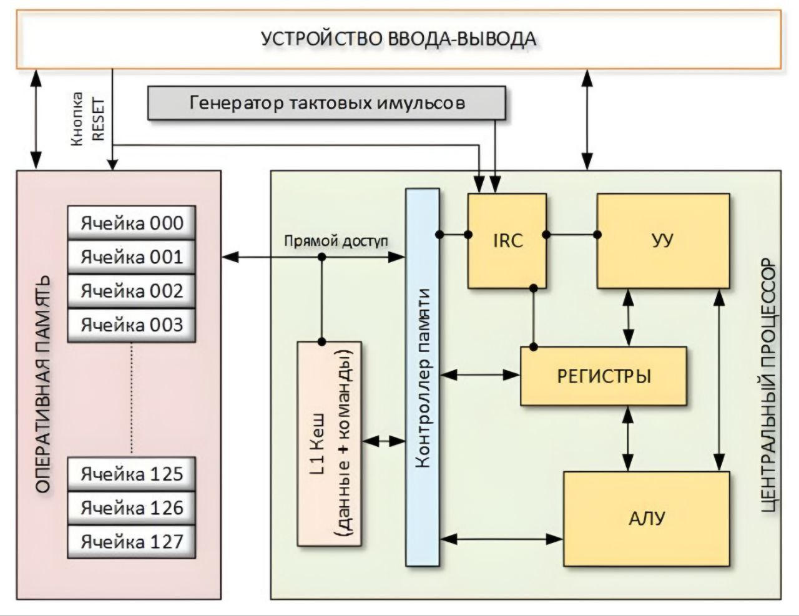
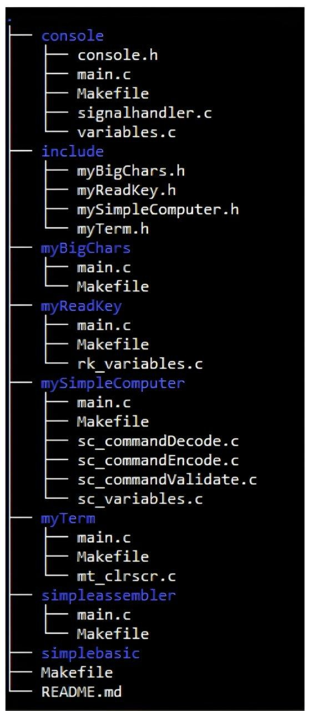

# Архитектуры ЭВМ - Лабораторные работы

Репозиторий для выполнения лабораторных работ по дисциплине "Архитектуры ЭВМ".

## 📋 Инструкция по созданию новых веток

Ветки создаются отдельно для каждой новой лабораторной работы из ветки `main`. При создании новой ветки, последний коммит должен называться **"Final x pr commit"**, где `x` — номер лабораторной работы.

## 🛠️  Сборка и запуск
- Все команды выполняются из корня проекта:
```markdown
|   Команда      |  Действие   |                            Описание                       |
------------------------------------------------------------------------------------------
|  `make`        | **Сборка**  | Компилирует `.c` файлы в `.o` и собирает исполняемый файл |
|  `make run`    | **Запуск**  | Компилирует проект (если нужно) и запускает приложение    |
|  `make clean`  | **Очистка** | Удаляет все временные объектные файлы и бинарники         |
```

## 📁 Структура проекта
```text
.
├── console
│   ├── console.h
│   ├── main.c
│   ├── Makefile
│   ├── signalhandler.c
│   ├── test.c
│   └── variables.c
├── include
│   ├── myBigChars.h
│   ├── myReadKey.h
│   ├── mySimpleComputer.h
│   └── myTerm.h
├── myBigChars
│   ├── main.c
│   └── Makefile
├── myReadKey
│   ├── main.c
│   ├── Makefile
│   └── rk_variables.c
├── mySimpleComputer
│   ├── main.c
│   ├── Makefile
│   ├── sc_commandDecode.c
│   ├── sc_commandEncode.c
│   ├── sc_commandValidate.c
│   └── sc_variables.c
├── myTerm
│   ├── main.c
│   ├── Makefile
│   └── mt_clrscr.c
├── simpleassembler
│   ├── main.c
│   └── Makefile
├── simplebasic
├── Makefile
├── README.md
└── photoKQ
    └── photo_1_1.jpg

```

## 🌳 Схема разработки


        

## ✅ Требования к каждой лабораторной работе

- [ ] Создать отдельную ветку из `main`
- [ ] Разделить работу поровну (50/50) между участниками
- [ ] Каждый разработчик работает после другого
- [ ] Объединить работу в финальный коммит
- [ ] Назвать финальный коммит "Final X lab commit"
- [ ] Не выполнять merge в исходную ветку лабораторной работы
- [ ] Добавлять к README.MD задачи лабораторной работы + контрольные вопросы и ответы на них

## 👥 Участники

- **Эльнур Гасымов Тофиг Оглы ИС-443** — Разработчик
- **Артем Учайкин Игоревич ИС-443** — Разработчик

---

# Практическое задание № 1. Подготовка инфраструктуры для разработки проекта.

## Цель работы: 
- [ ] Понять общую концепцию разрабатываемого программного продукта. 
- [ ] Определить список инструментов, необходимых для разработки программного продукта
- [ ] Подготовить инфраструктуру, необходимую для разработки программного продукта.

## Задание на практическое занятие
1. Прочитайте общее задание на практическую часть и курсовое проектирование по дисциплине «Архитектура ЭВМ»
2. Прочитайте требования к оформлению исходного кода разрабатываемого программного обеспечения
3. В репозитории проектов git.csc.sibsutis.ru создайте проект для вашей дальнейшей работы. Склонируйте получившийся проект к себе на рабочее место
4. Создайте в проекте структуру каталогов, соответствующую общему заданию на разработку программного продукта. Заполните файл README.md
5. В каталоге console создайте файл test.c и в нем напишите простейшую программу Hello World
6. Разработайте Makefile (множество Makefile), необходимых для сборки приложения test. При сборке обязательно должны использоваться промежуточные объектные файлы
7. Подготовьте описание для автоматической сборки проекта
8. Создайте минимум 1 коммит в нужной ветке. Отправьте этот коммит в репозиторий, созданный в п.3. Убедитесь, что все этапы сборки проекта прошли удачно
9. Подготовьте отчет о выполнении практического задания
    
## Контрольные вопросы
1. Какой проект будет разрабатываться в ходе выполнения практических заданий и курсового проектирования по дисциплине «Архитектура ЭВМ»?
  - В рамках выполнения практических заданий и курсового проектирования в процессе изучения дисциплины «Архитектура ЭВМ» необходимо разработать программную модель простейшей вычислительной машины Simple Computer и набор утилит по созданию для неё программного обеспечения. Архитектура Simple Computer представлена на рисунке 1 и включает следующие функциональные блоки: оперативную память, устройство ввода-вывода (терминал), центральный процессор и генератор тактовых импульсов
   

2. Какой язык программирования используется для разработки основной части проекта? Какой язык будете использовать для разработки трансляторов?
   - Основная часть модели Simple Computer (содержимое каталогов console, include, myBigChars, myReadKey mySimpleComputer, myTerm) разрабатывается с использованием языка программирования – Си (стандарт не ниже C11)
   - Трансляторы с языков программирования Simple Assembler и Simple Basic разрабатываются с применением любого языка программирования (на выбор автора). Оформление исходного кода указанных приложений производится в соответствие с общепринятыми требованиями к оформлению исходного кода соответствующего языка программирования
 
3. Какова структура каталогов разрабатываемого проекта? Что в каком каталоге будет содержаться?
   - Структура каталогов:
    
   - Содержимое каталогов проекта:
     - console содержит исходный код разрабатываемой консоли
     - include заголовочные файлы всех разрабатываемых библиотек
     - myBigChars, myReadKey, mySimpleComputer, myTerm – исходные коды соответствующих библиотек и тестов для них
     - simpleassembler – исходный код транслятора с языка Simple Assembler
     - simplebasic – исходный код транслятора с языка Simple Basic

 
4. Что такое git? Как им пользоваться? Продемонстрируйте основные этапы использования git для сохранения версий разрабатываемого программного продукта?
   - Git — это распределенная система контроля версий. Если говорить проще, это «машина времени» для вашего кода. Она позволяет сохранять снимки (коммиты) проекта, возвращаться к старым версиям, пробовать новые идеи в отдельных ветках и работать над одним файлом всей командой, не затирая правки друг друга. Git хранит только изменения и делает процесс разработки структурированным
   - Как пользоваться Git: Основные этапы:
     1. Подготовка (Инициализация) `git init`
     2. Индексация `git add .` или `git add <название файла>`
     3. Фиксация изменений `git commit -m "Сообщение того, что сделано"`
     4. Отправка в облако `git push origin <названние ветки>`

5. Что такое репозиторий git.csc.sibsutis.ru? Чем он отличается от git?
   - Это локальный сервер GitLab, развернутый в Сибирском государственном университете телекоммуникаций и информатики (СибГУТИ). Он служит хостингом для репозиториев студентов и преподавателей
 
6. Как настраивается автоматическая сбора программного обеспечения в git.csc.sibsutis.ru?   
   - Процесс настраивается через создание специального файла в корне проекта (.gitlab-ci.yml). Как только выполняется `git push`, сервер считывает инструкции из этого файла и запускает виртуальную машину, которая компилирует и тестирует код
 
7. Что такое make? Зачем нужен Makefile? Какова структура Makefile?
   - Make — это классическая утилита для автоматизации сборки программ. Она избавляет разработчика от необходимости вручную вводить длинные команды компиляции каждый раз, когда меняется код
   - Make решает две главные задачи:
     - Автоматизация: Заменяет цепочку команд `gcc...` одной короткой командой `make`
     - Умная сборка: Make смотрит на дату изменения файлов. Она пересоберет только те части проекта, которые изменили, и те, что от них зависят 
   - Структура Makefile состоит из набора правил
     - Цель (Target): Имя файла или название команды
     - Зависимости (Prerequisites): Исходные файлы или другие цели
     - Рецепт (Recipe): Команды терминала
    `цель: зависимости `
    `[TAB] рецепт (команда)`

        
   
     
8. Как происходит сборка программного обеспечения с помощью make? Умеет ли make собирать проект так, чтобы не делать шаги сборки, которые ранее были сделаны и не изменились?
   - Процесс сборки:
     1. Чтение Makefile
     2. Построение дерева зависимостей
     3. Проверка времени изменения
     4. Выполнение команд 
   - Пропуск сделанный шагов в Make 
     - Для неизмененных файлов: Make увидит, что соответствующие им .o файлы новее, чем .c исходники. Он пропустит их компиляцию 
     - Для измененного файла: Make увидит, что исходник .c обновился. Он пересоберет только этот конкретный .o файл
     - Этап линковки: Поскольку один из элементов (.o файл) обновился, Make заново соберет из них финальный исполняемый файл
    
    
---

**Последнее обновление:** 12 февраля 2026 г.
