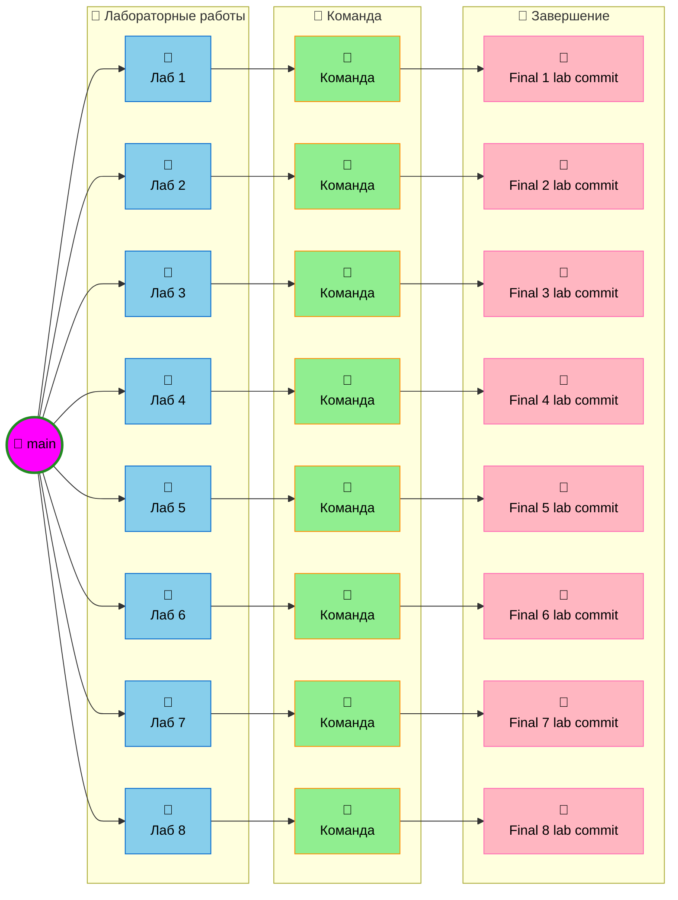

# Архитектуры ЭВМ - Лабораторные работы

Репозиторий для выполнения лабораторных работ по дисциплине "Архитектуры ЭВМ".

## 📋 Инструкция по созданию новых веток

Ветки создаются отдельно для каждой новой лабораторной работы из ветки `main`. При создании новой ветки, последний коммит должен называться **"Final x lab commit"**, где `x` — номер лабораторной работы.

## 🌳 Схема разработки

        

## ✅ Требования к каждой лабораторной работе

- [ ] Создать отдельную ветку из `main`
- [ ] Разделить работу поровну (50/50) между участниками
- [ ] Каждый разработчик работает после другого
- [ ] Объединить работу в финальный коммит
- [ ] Назвать финальный коммит "Final X lab commit"
- [ ] Не выполнять merge в исходную ветку лабораторной работы
- [ ] Добавлять к README.MD задачи лабораторной работы + контрольные вопросы и ответы на них

## 👥 Участники

- **Эльнур** — Главный разработчик
- **Артем** — Секретарь стриптизер

---

**Последнее обновление:** 11 февраля 2026 г.
